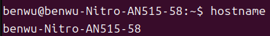
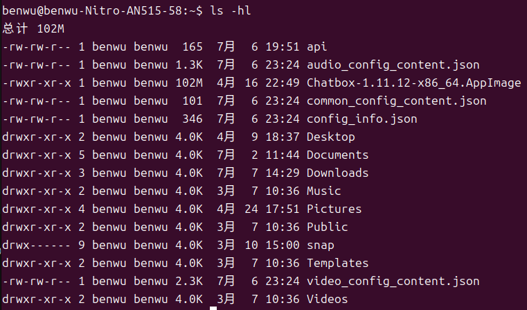
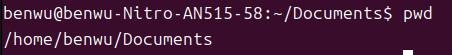
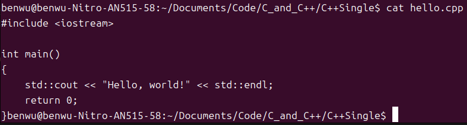
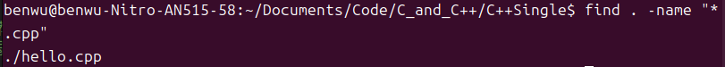
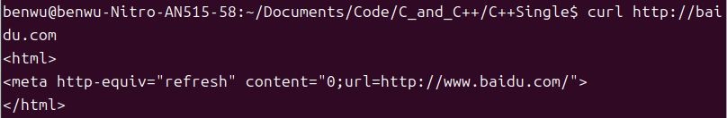
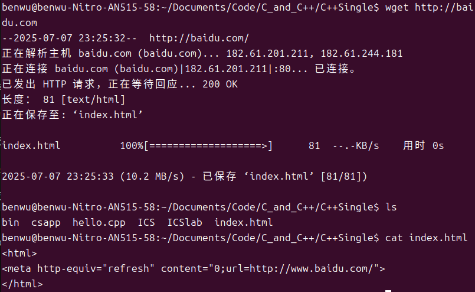

# 系统信息和资源查看
## 1. `hostname` - 查看主机名


## 2. `whoami` - 查看当前用户

# 文件与目录操作
## 1. `ls` - 列出文件和目录

列出当前目录下的文件和子目录，常配合参数使用：

```bash
ls           # 列出当前目录下的文件（不包括隐藏文件）
ls -al       # 列出所有文件，包括隐藏文件，并显示详细信息
```

---

## 2. `cd` - 改变当前目录

切换目录：

```bash
cd /home/user/Documents   # 切换到绝对路径目录
cd ..                     # 返回上一级目录
cd ~                      # 回到用户主目录
cd -                      # 回到上一次所在的目录
```

---

## 3. `pwd` - 显示当前路径

Print Working Directory，显示你当前所在的目录：

```bash
pwd
# 输出示例：
# /home/user/Documents
```

---

## 4. `mkdir` - 创建目录

用于新建目录：

```bash
mkdir mydir            # 创建一个目录
mkdir -p a/b/c         # 递归创建多层目录（若中间不存在也会一并创建）
```

---

## 5. `rm` - 删除文件或目录

**危险命令，请谨慎使用！**

```bash
rm file.txt            # 删除单个文件
rm -r dir/             # 递归删除目录及其内容
rm -rf /path/to/dir    # 强制递归删除（不询问）⚠️ 小心使用
```

---

## 6. `cp` - 复制文件或目录

```bash
cp file1.txt file2.txt         # 将 file1.txt 复制为 file2.txt
cp file.txt /tmp/              # 复制文件到其他目录
cp -r dir1/ dir2/              # 递归复制目录
```

---

## 7. `mv` - 移动或重命名

```bash
mv file.txt /tmp/              # 移动文件
mv oldname.txt newname.txt     # 重命名文件
mv dir1/ /home/user/           # 移动目录
```

---

## 8. `touch` - 创建空文件或更新时间戳

```bash
touch newfile.txt              # 创建一个空文件（如果不存在）
touch file.txt                 # 如果文件存在，则更新其访问和修改时间
```

---

## 9. `cat` - 显示文件内容

```bash
cat file.txt                   # 显示整个文件内容
cat file1 file2 > merged.txt   # 合并两个文件并保存为新文件
```

⚠️ 如果文件太长，不建议用 `cat`，可用 `less` 或 `more`

---

## 10. `less` / `more` - 分页查看内容

```bash
less file.txt                  # 上下翻页查看内容（推荐）
more file.txt                  # 类似 less，但功能稍弱
```

---

## 11. `find` - 查找文件或目录

```bash
find . -name "*.txt"           # 在当前目录下查找所有 `.txt` 文件
find /etc -type d              # 查找所有目录
find . -size +10M              # 查找大于 10MB 的文件
```

---

# 文件授权 - `chmod`
`chmod`（**change mode**）是 Linux 中用于**修改文件或目录权限**的命令，掌握 `chmod` 对理解文件安全控制至关重要。

---

## 一、Linux 文件权限基础

Linux 中的权限由三类用户定义：

| 用户类别  | 含义          |
| ----- | ----------- |
| **u** | 所有者（user）   |
| **g** | 所在组（group）  |
| **o** | 其他人（others） |
| **a** | 所有用户（all）   |

每类用户都可以设置三种权限：

| 权限 | 符号  | 含义               |
| -- | --- | ---------------- |
| 读  | `r` | 可读取内容            |
| 写  | `w` | 可修改内容            |
| 执行 | `x` | 可执行（程序或脚本）；目录可进入 |

例如：

```bash
-rwxr-xr--  1 user group  1234 Jul 7  test.sh
```

* 第一位 `-` 表示文件类型（`d` 表示目录）
* 后续 9 位权限分为三组：`rwx`（用户） `r-x`（组） `r--`（其他）

---

## 二、chmod 用法形式

### 1. **符号模式（推荐初学者）**

```bash
chmod [ugoa][+-=][rwx] 文件名
```

#### 示例：

| 命令                     | 说明            |
| ---------------------- | ------------- |
| `chmod u+x script.sh`  | 给“所有者”加上执行权限  |
| `chmod g-w file.txt`   | 去掉“组用户”的写权限   |
| `chmod o=r file.txt`   | 将“其他人”权限设置为只读 |
| `chmod a+x run.sh`     | 所有人都赋予执行权限    |
| `chmod ug=rw file.txt` | 设置用户与组权限为读写   |

---

### 2. **数字模式（更高效）**

每种权限对应一个数字（加起来表示组合）：

| 权限组合    | 数值 |
| ------- | -- |
| `r` = 4 |    |
| `w` = 2 |    |
| `x` = 1 |    |

计算方式：

* `rwx` = 4 + 2 + 1 = **7**
* `rw-` = 4 + 2 = **6**
* `r--` = 4 = **4**

顺序为：**所有者(u)、组(g)、其他人(o)**

#### 示例：

| 命令                     | 说明                          |
| ---------------------- | --------------------------- |
| `chmod 755 file.sh`    | 所有者 `rwx`，组与其他人 `rx`（常用于脚本） |
| `chmod 644 file.txt`   | 所有者 `rw`，组与其他人 `r`（常用于文本）   |
| `chmod 700 secret.txt` | 只有所有者有读写执行权限                |
| `chmod 777 file`       | 所有人读写执行（⚠️高风险）              |

---

## 三、常用组合说明

| 模式    | 数值                            | 含义（u\:g\:o） |
| ----- | ----------------------------- | ----------- |
| `777` | 所有人都可以读、写、执行（**极不安全**）        |             |
| `755` | 拥有者读写执行，其他用户只读执行（**可执行程序常用**） |             |
| `644` | 拥有者读写，其他用户只读（**文本文件常用**）      |             |
| `600` | 仅拥有者读写（**私密文件**）              |             |
| `400` | 仅拥有者只读                        |             |

---

## 四、chmod 对目录的作用

| 权限  | 含义（对目录）          |
| --- | ---------------- |
| `r` | 可查看目录下文件列表（`ls`） |
| `w` | 可在目录中创建/删除/重命名文件 |
| `x` | 可进入该目录（`cd`）     |

> 想让用户能“访问某目录”，**必须有执行权限（x）**

### 示例：

```bash
chmod 755 mydir         # 允许所有人访问目录内容
chmod 700 private_dir   # 仅限拥有者访问
```

---

## 五、批量修改 + 递归修改

```bash
chmod -R 755 /var/www/html
```

* `-R` 表示递归修改子目录和文件权限
* 小心使用，尤其在系统目录中！

## 六、SSH密钥配置与chmod使用案例
```bash
chmod 700.ssh
# 仅有密钥所有者能够读写和执行.ssh目录下的文件
chmod 600.ssh/authorized_keys
# 仅有密钥所有者能够读写已验证公钥，防止被他人修改，加上自己的公钥登录
```  

---
<br>

# 软件包管理

## 一、常用命令
| 命令 | 功能 |
| --- | --- |
| `sudo apt update`                   | 更新软件源列表 |
| `sudo apt upgrade`                  | 升级所有已安装的软件 |
| `sudo apt install package`          | 安装软件包 |
| `sudo apt remove package`           | 卸载软件包 |
| `sudo apt autoremove`               | 自动移除无用依赖 |
| `dpkg -l`                           | 查看已安装软件 |
| `which command` / `whereis command` | 查找命令位置 |

## 二、apt和dpkg的区别
- `apt` - 高层封装工具：管理包及依赖，自动从软件源下载、更新、配置
- `dpkg` - 底层工具：安装、卸载 .deb 包，不处理依赖
- 常用命令对比

| 功能           | `apt` 命令                                | `dpkg` 命令              | 说明                      |      |
| ------------ | --------------------------------------- | ---------------------- | ----------------------- | ---- |
| 安装 `.deb` 文件 | `sudo apt install ./xxx.deb`            | `sudo dpkg -i xxx.deb` | `apt` 会自动补齐依赖，`dpkg` 不会 |      |
| 卸载软件         | `sudo apt remove pkgname`               | `sudo dpkg -r pkgname` | 都能卸载，`apt` 会处理依赖清理      |      |
| 强制清除配置       | `sudo apt purge pkgname`                | `sudo dpkg -P pkgname` | 删除残留配置文件                |      |
| 查看软件是否已安装    | `apt list pkgname`                      | `dpkg -l`              | `grep pkgname`          | 两者都能 |
| 列出已安装软件      | `apt list --installed`                  | `dpkg -l`              | 显示格式略有不同                |      |
| 查看某个包的文件列表   | `apt content pkgname`（需额外安装 `apt-file`） | `dpkg -L pkgname`      | `dpkg` 更直接              |      |
| 查看某个文件属于哪个包  | `apt-file search /bin/ls`               | `dpkg -S /bin/ls`      | `dpkg` 仅限已安装包           |      |


## 三、apt和apt-get的区别
- `apt-get`是老工具，Debiann原生支持。
- `apt`是`apt-get`和`apt-cache`的常用子集，适合用户日常使用。

也就是说：

> `apt` = 更人性化的 `apt-get` + `apt-cache` 子集

---


- 命令行输出区别

* `apt` 输出更友好、更简洁，带有进度条、高亮提示。
* `apt-get` 更详细，适合日志分析和脚本使用。

```bash
apt install htop
# 会显示：
#   0 upgraded, 1 newly installed, ...
#   Do you want to continue? [Y/n] ← 高亮交互

apt-get install htop
# 同样功能，但输出更像日志，没有进度条或颜色
```

---

- 什么时候用哪个？

| 使用场景               | 推荐命令              | 理由             |
| ------------------ | ----------------- | -------------- |
| 日常使用               | `apt`             | 简洁直观，功能全面      |
| Shell 脚本           | `apt-get`         | 向后兼容，稳定可靠      |
| 高级功能（如 `download`） | `apt-get`         | `apt` 不提供所有命令  |
| 查询包信息              | `apt show/search` | 替代 `apt-cache` |

---
<br>

# 网络相关命令
## 一、常用命令表

| 命令                             | 功能                 |
| ------------------------------ | ------------------ |
| `ping example.com`             | 测试网络连通性            |
| `ifconfig` / `ip a`            | 查看网络配置（`ip a` 更推荐） |
| `netstat -tulnp` / `ss -tulnp` | 查看端口占用             |
| `curl http://example.com`      | 获取网页内容             |
| `wget URL`                     | 下载文件               |
| `scp file user@host:/path`     | 远程拷贝文件             |
| `ssh user@host`                | 远程登录服务器            |

---

## 二、curl和wget的区别
- 基本区别

| 对比项         | `curl`                                     | `wget`                            |
| ----------- | ------------------------------------------ | --------------------------------- |
| 名称含义        | "Client URL"                               | "Web get"                         |
| 是否默认安装      | 通常预装在大多数系统中                                | 有时需手动安装                           |
| 支持协议        | ✅ HTTP, HTTPS, FTP, SFTP, SCP, LDAP, SMB 等 | ✅ HTTP, HTTPS, FTP 等（不如 `curl` 广） |
| 下载功能        | 支持（但默认只打印）                                 | 专为下载设计，自动保存                       |
| 支持递归下载      | ❌ 不支持                                      | ✅ 支持递归下载整个网站                      |
| 多线程/断点续传    | ✅ 支持 `-C -` 续传（手动）                         | ✅ 自动支持断点续传                        |
| 支持上传        | ✅ 支持（FTP/SFTP/HTTP POST）                   | ❌ 不支持上传                           |
| 脚本可控性       | ✅ 非常适合编程和 API 调试                           | ⛔️ 控制较弱                           |
| JSON/API 支持 | ✅ 强（支持 HTTP header、POST、PUT、auth 等）        | ⛔️ 几乎没有                           |
---  
<br>

- `curl` - 下载网页url并打印在终端

- `wget` - 专用于下载文件，同样对baidu.com执行，会保存在文件中


---
- 什么时候用哪个？

| 场景                         | 推荐工具   | 原因          |
| -------------------------- | ------ | ----------- |
| 简单下载文件                     | `wget` | 自动保存，断点续传方便 |
| 与 API 交互（如 POST、PUT、Token） | `curl` | 强大的请求构造能力   |
| 脚本控制（返回码、输出）               | `curl` | 更灵活         |
| 批量网站备份 / 镜像                | `wget` | 支持递归、镜像下载   |
| FTP/SFTP 上传                | `curl` | `wget` 不支持  |
---
<br>

# 压缩文件管理
## 一、常见压缩格式与工具

| 格式         | 工具            | 命令行支持  | 特点       |
| ---------- | ------------- | ------ | -------- |
| `.tar`     | `tar`         | ✅      | 打包归档，不压缩 |
| `.tar.gz`  | `tar + gzip`  | ✅      | 常见，压缩快   |
| `.tar.bz2` | `tar + bzip2` | ✅      | 压缩率高，速度慢 |
| `.tar.xz`  | `tar + xz`    | ✅      | 更高压缩比    |
| `.zip`     | `zip/unzip`   | ✅      | 跨平台通用    |
| `.gz`      | `gzip/gunzip` | ✅      | 单文件压缩    |
| `.7z`      | `7z`（p7zip）   | ✅（需安装） | 高压缩比，多功能 |
---

## 二、选择情况

| 使用场景            | 推荐格式              | 理由   |
| --------------- | ----------------- | ---- |
| Linux 下打包、备份    | `.tar.gz`         | 快速兼容 |
| 跨平台（Windows 共享） | `.zip`            | 通用   |
| 极限压缩率（节省空间）     | `.tar.xz` / `.7z` | 最小体积 |
| 单文件压缩           | `.gz`             | 简单方便 |
---
<br>

# 用户与权限管理
| 命令                       | 功能          |
| ------------------------ | ----------- |
| `adduser username`       | 添加新用户       |
| `sudo passwd username`   | 修改用户密码      |
| `usermod -aG group user` | 将用户添加到组中    |
| `groups`                 | 查看当前用户所属的组  |
| `sudo`                   | 以超级用户权限运行命令 |
| `su`                     | 切换用户        |


